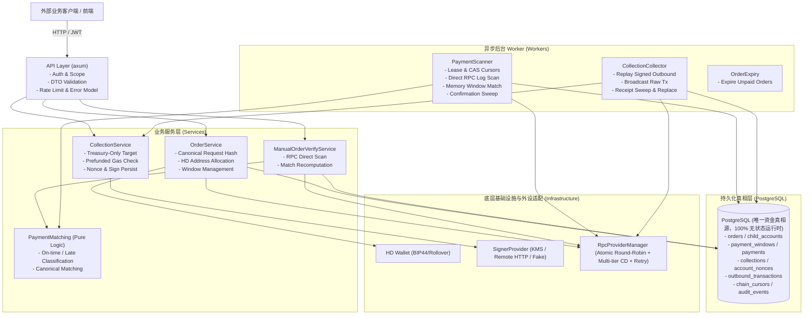

# Pay3 系统架构说明 (System Architecture)

本文档阐述 Pay3 核心系统架构、分层模型、数据流转机制、API 端点契约与数据库设计。
关联运维与上线规范请参阅：
- 生产部署架构与说明：[docs/DEPLOYMENT.md](file:///ssd0/git/pay3/docs/DEPLOYMENT.md)
- 生产运维与故障处理手册：[docs/RUNBOOK.md](file:///ssd0/git/pay3/docs/RUNBOOK.md)
- 生产就绪验收审计：[docs/PRODUCTION_READINESS.md](file:///ssd0/git/pay3/docs/PRODUCTION_READINESS.md)

---

## 1. 架构概览与拓扑图

Pay3 采用分层解耦、职责严格单向依赖的工程架构：



---

## 2. 模块边界与单向依赖原则

系统内部各模块的职责与依赖关系严格限定：

```text
api -> services -> repositories / chain / wallet / signer / outbound
services -> domain
repositories -> domain
chain / signer / outbound -> domain (仅引用基础值对象)
```

### 绝对禁止的依赖越界：
- `api` 严禁直接拼装或执行 SQL，必须通过 `services` 或 `repositories`。
- `db` 严禁调用外部区块链 RPC 或签名器。
- `chain` 严禁感知任何 API 协议或 HTTP DTO。
- 业务资金状态严格由 PostgreSQL 事务维护，禁止引入本地临时持久化文件。
- 绝不保存私钥或敏感 Secret 在非加密存储中。

---

## 3. 存储与无状态设计 (100% Stateless Container Runtime)

| 存储引擎 | 定位 | 保存内容 | 运维与可靠性 |
| :--- | :--- | :--- | :--- |
| **PostgreSQL** | **唯一权威资金真相源** | 订单状态、关联子地址、支付窗口、已匹配到 Pay3 的 payments、业务扫描游标 `chain_cursors`、归集单、Nonce 预留、Outbound 事务、资金审计事件。 | 不可丢失，需开启 WAL、归档与 PITR 备份保障。应用容器不挂载任何数据卷，100% 无状态启动与水平部署。 |

---

## 4. 关键业务流程与机制

### 4.1 订单创建与地址无限派生 (HD Derivation)
1. 客户端携带 JWT 请求 `POST /v1/orders`。
2. Service 层计算标准 `request_hash` 并利用数据库 advisory lock / 唯一键做幂等检查。
3. 获取当前链头块高作为支付窗口下界。
4. 从 `wallet_cursors` 悲观锁递增分配下一个 HD 派生索引（`address_index -> change_index -> account_index` 自动进位）。
5. 派生生成唯一的 `receive_address`。
6. 开启事务落盘 `child_accounts`、`orders`、`payment_windows`。一个地址永久属于该订单，数据库级别强制唯一约束。

### 4.2 直连扫链匹配与确认 (Direct-to-Postgres Payment Scanner & Confirmation)
1. `workers/scanner` 获取 PostgreSQL `chain_cursors` 的排他 Lease 与 CAS 检查。
2. 通过 `RpcRangeSource`（带负载均衡与智能熔断）直接调用 `eth_getLogs` 批量拉取区间内的 Transfer 事件。
3. 结合 `PaymentWindowLookup`（内存活跃订单缓存 + PostgreSQL 批量 Fallback）在内存中快速比对本平台活跃收款地址。
4. 匹配支付记录并判断时效（`on_time`、`late`、`outside_window`），未命中本平台的非相关交易直接丢弃，不落盘。
5. 单事务提交命中的支付记录、更新订单金额与状态、推进 PostgreSQL 游标。
6. 空闲 Tick 执行 Confirmation Sweep：校验 stored block hash 仍然为规范链块（canonical），满足 `MIN_CONFIRMATIONS` 后推进为 `confirmed`。

### 4.4 资金归集与崩溃恢复 (Collection & Outbound Lifecycle)
1. 调用方请求 `POST /v1/collections`（仅限 `collections:create` scope）。
2. 校验关联订单处于 `paid` 状态，强制指定目标地址为 `TREASURY_ADDRESS`。
3. 检查子地址原生 Gas 余额（Prefunded Gas Check）及 ERC20 Token 余额。
4. 预留账户 Nonce，拼装 ERC20 `transfer(treasury, amount)` Calldata。
5. 请求 `SignerProvider` 签名并**立即落盘** `outbound_transactions`（含 Raw Signed Tx）。
6. Collector Tick 调度：
   - **崩溃恢复第一优先级**：先扫描并重播所有已签名但未广播成功的 Outbound 交易。
   - **常规广播**：通过 RPC 广播已持久化的 Raw Signed Tx，核对 Tx Hash 一致后标记为 `broadcast`。
   - **收据轮询与超时替代**：轮询 Receipt 推进到 `confirmed`；若长期未上链，触发同 Nonce Replacement（提升 Gas，保留原始审计记录）。

---

## 5. 核心 API 端点与接口契约

所有端点均要求 `Authorization: Bearer <token>` 且通过端点级 Scope 校验。错误响应统一遵循 `{ "code": ..., "message": ..., "request_id": ..., "retryable": ..., "details": ... }`。

| HTTP 方法与路径 | 所需 Scope | 功能说明 | 核心返回 |
| :--- | :--- | :--- | :--- |
| `POST /v1/orders` | `orders:create` | 创建订单，分配唯一收款地址 | `201 Created` / `200 OK` (幂等)，包含 `receive_address`、`expires_at` 等 |
| `GET /v1/orders/{id}` | `orders:read` | 查询订单详情与付款状态 | `200 OK`，包含状态（`pending/partial/confirming/paid/expired`） |
| `GET /v1/orders/by-external-id/{external_id}` | `orders:read` | 按调用方外部业务订单号查询 | 同上 |
| `POST /v1/orders/{id}/verify` | `orders:verify` | 手动触发订单付款匹配与状态重算 | `200 OK`，包含重算后最新订单状态与匹配明细 |
| `POST /v1/collections` | `collections:create` | 为已支付订单发起归集（限 Treasury） | `201 Created` / `200 OK` (幂等)，生成 `outbound_tx_id` |
| `GET /v1/collections/{id}` | `collections:read` | 查询归集交易进度与 Tx Hash | `200 OK`，包含状态（`queued/transferring/confirming/confirmed`） |
| `GET /healthz` | 无 | 进程健康存活探针 | `200 OK` |
| `GET /readyz` | 无 | 完整依赖可用性探针（DB/RPC/Signer/KV） | `200 OK` / `503 Service Unavailable` |
| `GET /metrics` | 无 | Prometheus 监控指标拉取 | Prometheus 格式指标流 |

---

## 6. PostgreSQL 核心表模型与数据完整性保障

数据库层通过严格外键、唯一索引与正则 CHECK 保证核心不变量无法被直接 SQL 绕过：

| 表名 | 作用与核心约束 | 关键防线 |
| :--- | :--- | :--- |
| `wallet_cursors` | 保存 HD 钱包派生进位索引 (`account/change/address`) | 单行行级锁排他递增，防止地址派生并发重复 |
| `child_accounts` | 派生子地址实体表 | `address` 唯一索引；记录完整 HD 路径，与订单 1:1 终身绑定 |
| `orders` | 订单主表 | `receive_address` 具备唯一性约束（严禁地址复用）；状态机取值范围 CHECK |
| `payment_windows` | 订单支付有效时间与区块范围表 | 复合外键强绑定 `orders(id, child_account_id, receive_address)` |
| `payments` | 链上转账匹配明细表 | `(chain_id, tx_hash, log_index)` 联合唯一；按区块时间戳标记 `on_time/late/outside_window` |
| `chain_cursors` | 扫链游标排他租约表 | 带 `lease_until` 与 CAS 机制，记录 `seen_kv_reorg_epoch` 联动分叉回滚 |
| `collections` | 资金归集任务单 | 外键关联 `treasury_addresses`；一个子地址同一时刻仅允许一个活跃归集 |
| `account_nonces` | 归集子账户 Nonce 预留表 | 串行锁 Nonce 递增，消除并发发交易时的 Nonce 空洞 |
| `outbound_transactions`| 链上出向交易持久化表 | Partial Unique Index 约束 `(chain_id, from_address, nonce)` 仅有一个 Active，支持 Replacement 历史追踪 |
| `audit_events` | 资金敏感操作审计日志表 | 只增不改，记录每次创建归集、签名、广播与替代的责任追踪 |
